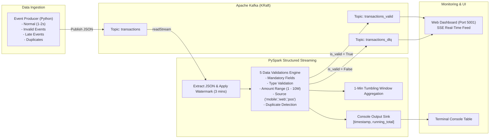

# 🚀 Building Real-Time Data Pipelines with Kafka & Spark Streaming

[](https://spark.apache.org/)
[](https://kafka.apache.org/)
[](https://python.org/)
[](https://docker.com/)

Repositori ini berisi implementasi lengkap **End-to-End Real-Time Streaming Data Pipeline** untuk data transaksi finansial menggunakan **Apache Kafka** dan **PySpark Structured Streaming** sesuai dengan panduan tugas *Building Real-Time Data Pipelines with Kafka and Spark Streaming*.

---

## 📑 Daftar Isi
- [Arsitektur Pipeline](#-arsitektur-pipeline)
- [Struktur Folder](#-struktur-folder)
- [1. Event Producer (`/producer/producer.py`)](#1--event-producer-producerproducerpy)
- [2. PySpark Streaming Job (`/streaming/spark_streaming_job.py`)](#2--pyspark-streaming-job-streamingspark_streaming_jobpy)
  - [5 Validasi Wajib](#-5-validasi-wajib)
  - [Watermark & Late Event Handling](#-watermark--late-event-handling)
  - [Output Routing (Valid vs DLQ)](#-output-routing-valid-vs-dlq)
  - [Tumbling Window & Console Output](#-tumbling-window--console-output)
- [3. Real-Time Web Dashboard](#3--real-time-web-dashboard)
- [🚀 Panduan Menjalankan Sistem](#-panduan-menjalankan-sistem)
- [📸 Panduan Screenshot Pengumpulan Tugas](#-panduan-screenshot-pengumpulan-tugas)

---

## 🏗️ Arsitektur Pipeline



---

## 📁 Struktur Folder

Sesuai dengan ketentuan pengumpulan tugas, struktur repositori ini disusun sebagai berikut:

```text
.
├── producer/
│   ├── producer.py             # Event Producer Kafka (Normal, Invalid, Late, Duplicates)
│   └── requirements.txt        # Dependensi Producer
├── streaming/
│   └── spark_streaming_job.py  # PySpark Structured Streaming Job (Validasi, Watermark, Routing)
├── src/                        # Mirror path untuk eksekusi container
│   ├── checkpoints/            # Directory checkpoint Spark Streaming
│   ├── dashboard/              # Aplikasi Flask Web Dashboard Real-Time
│   │   ├── app.py
│   │   ├── requirements.txt
│   │   └── templates/index.html
│   ├── producer/               # Mirror script producer
│   └── spark/                  # Mirror script spark job
├── docker-compose.yml          # Otomasi deployment Kafka, Spark, Producer, & Dashboard
├── requirements.txt            # Dependensi Python utama
└── README.md                   # Dokumentasi lengkap
```

---

## 1. 📡 Event Producer (`/producer/producer.py`)

Event Producer bertugas memproduksi event transaksi ke Kafka topic `transactions` setiap **1–2 detik** dengan skema JSON:

```json
{
  "user_id": "U12345",
  "amount": 150000,
  "timestamp": "2025-12-14T09:00:20Z",
  "source": "mobile"
}
```

### ✨ Fitur Utama Producer:
1. **Normal Transactions**: Menghasilkan transaksi valid dengan `user_id` unik, `amount` nominal normal (Rp 10.000 – Rp 5.000.000), `source` acak (`mobile`, `web`, `pos`), dan timestamp UTC aktual.
2. **Simulasi Event INVALID** (Minimal 3 kategori sesuai panduan):
   - **Amount Negatif / Terlalu Besar**: `amount = -50000` atau `amount = 50000000` (> 10.000.000).
   - **Timestamp Tidak Valid**: Malformed date seperti `"2025-99-99T99:99:99Z"` atau string tidak valid.
   - **Source Tidak Dikenal**: Source diluar ketentuan seperti `"smart_tv"`, `"crypto_terminal"`.
   - **Missing Mandatory Field**: `user_id = null` atau `amount = null`.
   - **Duplicate Event**: Mengirim ulang event transaksi yang sama persis (`user_id` + `timestamp`).
3. **Simulasi Late Events** (Minimal 3 event):
   - Menghasilkan transaksi dengan timestamp **4 hingga 10 menit di masa lalu** (melewati ambang batas watermark 3 menit).

---

## 2. ⚙️ PySpark Streaming Job (`/streaming/spark_streaming_job.py`)

PySpark Structured Streaming membaca aliran data dari topic `transactions` menggunakan Kafka Source connector.

### 🛡️ 5 Validasi Wajib

Setiap event yang masuk dievaluasi melalui 5 aturan validasi:

| No | Aturan Validasi | Kriteria Pengecekan | Aksi Jika Gagal |
|---|---|---|---|
| 1 | **Mandatory Field Check** | `user_id`, `amount`, `timestamp`, `source` tidak boleh null atau kosong | `is_valid=False`, `error_reason="Missing mandatory field: ..."` |
| 2 | **Type Validation** | `timestamp` harus berformat ISO valid, `amount` berupa tipe data numerik | `is_valid=False`, `error_reason="Type validation failed: ..."` |
| 3 | **Range Validation** | `1 <= amount <= 10.000.000` | `is_valid=False`, `error_reason="Range validation failed: ..."` |
| 4 | **Source Validation** | `source` harus salah satu dari `["mobile", "web", "pos"]` | `is_valid=False`, `error_reason="Source validation failed: ..."` |
| 5 | **Duplicate Detection** | Deteksi duplikasi berdasarkan pasangan (`user_id` + `timestamp`) | `is_valid=False`, `error_reason="Duplicate transaction: ..."` |

### ⏳ Watermark & Late Event Handling
- Menggunakan konfigurasi watermark:
  ```python
  .withWatermark("event_time", "3 minutes")
  ```
- Data yang memiliki timestamp lebih lambat dari 3 menit (> 180 detik) secara otomatis ditandai sebagai `is_valid = False` dengan alasan `"Watermark violation: event timestamp is > 3 minutes late"` dan diarahkan ke DLQ.

### 🔀 Output Routing (Valid vs DLQ)
Setiap record diperkaya dengan kolom `is_valid` dan `error_reason`:
- **Data Valid (`is_valid == True`)** ➔ Dipublish ke Kafka topic: **`transactions_valid`**
- **Data Invalid (`is_valid == False`)** ➔ Dipublish ke Kafka topic: **`transactions_dlq`** (Dead Letter Queue)

### 📊 Tumbling Window & Console Output
- **Tumbling Window Monitoring**: Window size **1 menit** (`window(col("event_time"), "1 minute")`) yang menghitung jumlah transaksi valid, total amount, dan rata-rata per window.
- **Console Output**: Menggunakan `foreachBatch` untuk menampilkan metrik kumulatif secara real-time dengan kolom wajib:
  - **`timestamp`**: Waktu eksekusi output Spark.
  - **`running_total`**: Total kumulatif nominal (Rp) seluruh transaksi valid.

Contoh tampilan di konsol terminal:
```text
+-----------------------+---------------+--------+-----------+---------+---------------+-------------+
|timestamp              |running_total  |batch_id|batch_valid|batch_dlq|cum_valid_count|cum_dlq_count|
+-----------------------+---------------+--------+-----------+---------+---------------+-------------+
|2026-08-19 01:30:15 UTC|18750000.0     |4       |5          |2        |24             |8            |
+-----------------------+---------------+--------+-----------+---------+---------------+-------------+
```

---

## 3. 🌟 Real-Time Web Dashboard

Tersedia web dashboard interaktif yang dapat diakses di **`http://localhost:5001`**:
- Menampilkan metrik real-time: **Running Total (Rp)**, **Valid Count**, **DLQ Count**, dan **Validation Pass Rate (%)**.
- Menampilkan live feed transaksi valid dari topik `transactions_valid` (badge hijau).
- Menampilkan live feed event yang ditolak ke `transactions_dlq` beserta **alasan penolakan / error reason** (badge merah).

---

## 🚀 Panduan Menjalankan Sistem

### Langkah 1: Jalankan Seluruh Infrastruktur dengan Docker Compose
Buka terminal di root folder proyek, lalu jalankan:
```bash
docker compose up -d --build
```
*Perintah ini akan menyalakan container Kafka, Spark Master, Spark Worker, Producer, Spark Streaming Job, dan Dashboard secara otomatis.*

### Langkah 2: Memantau Log Event Producer
Untuk melihat event transaksi (Normal, Invalid, Late, Duplicate) yang dikirim ke Kafka:
```bash
docker logs -f producer
```

### Langkah 3: Memantau Output PySpark Streaming Job
Untuk melihat tabel validasi, agregasi Tumbling Window, serta output `[timestamp, running_total]`:
```bash
docker logs -f spark-job
```

Atau jika ingin menjalankan Spark Submit secara manual di dalam container `spark-master`:
```bash
docker exec -it spark-master spark-submit \
  --packages org.apache.spark:spark-sql-kafka-0-10_2.12:3.5.0 \
  /app/streaming/spark_streaming_job.py
```

### Langkah 4: Buka Web Dashboard
Buka browser dan akses:
👉 **`http://localhost:5001`**

### Langkah 5: Mematikan Sistem
Jika sudah selesai:
```bash
docker compose down
```

---

## 📸 Panduan Screenshot Pengumpulan Tugas

Berdasarkan ketentuan tugas, berikut panduan untuk mengambil screenshot:

1. **Screenshot Kafka Producer**:
   - Jalankan `docker logs -f producer` di terminal.
   - Ambil screenshot yang memperlihatkan log `[VALID]`, `[INVALID]`, `[LATE EVENT]`, dan `[DUPLICATE]`.

2. **Screenshot Streaming Console Output**:
   - Jalankan `docker logs -f spark-job` di terminal.
   - Ambil screenshot yang memperlihatkan tabel `[ASSIGNMENT REQUIRED CONSOLE OUTPUT: timestamp & running_total]` serta tabel detail validasi record.

3. **Screenshot Topik Valid & DLQ (Opsional)**:
   - Ambil screenshot tampilan Web Dashboard di `http://localhost:5001` yang menampilkan panel **`transactions_valid`** dan **`transactions_dlq`**.
   - Atau gunakan Kafka console consumer:
     ```bash
     docker exec -it kafka /opt/bitnami/kafka/bin/kafka-console-consumer.sh --bootstrap-server localhost:9092 --topic transactions_valid --from-beginning
     docker exec -it kafka /opt/bitnami/kafka/bin/kafka-console-consumer.sh --bootstrap-server localhost:9092 --topic transactions_dlq --from-beginning
     ```
